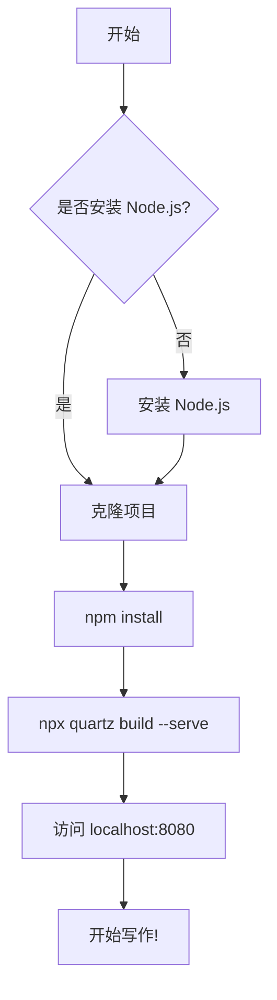
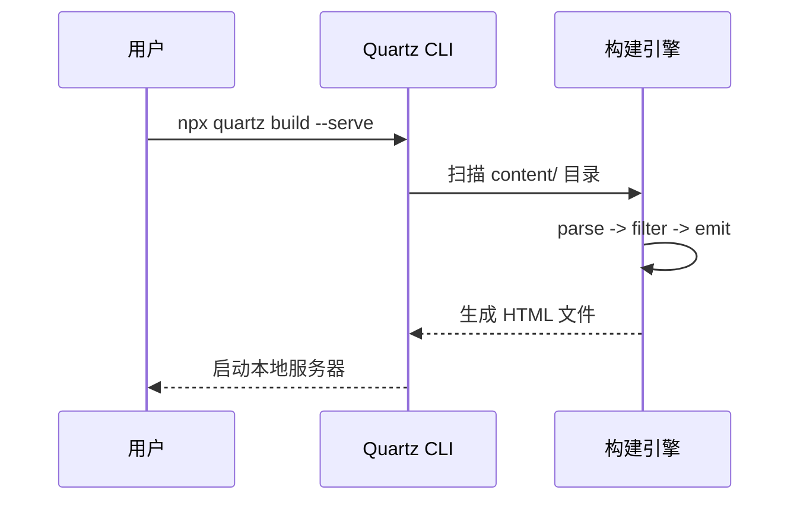

环境和目录结构都准备好了，现在让我们动手写第一篇博客文章。这一节会从创建文件开始，逐步讲解 Frontmatter 元数据、Quartz 支持的扩展 Markdown 语法，以及如何构建并预览你的文章。

## 一、创建 Markdown 文件

在 `content/` 目录下创建一个新的 Markdown 文件。你可以在已有的文件夹中创建，也可以新建一个文件夹来组织内容。

```bash
# 在 content/ 下新建一个文件夹
mkdir -p content/guide

# 创建第一篇文章
touch content/guide/my-first-post.md
```

然后使用你喜欢的编辑器打开 `content/guide/my-first-post.md`，开始编写内容。

## 二、Frontmatter —— 文章元数据

Frontmatter 是 Markdown 文件开头的一段 YAML 格式元数据，用 `---` 包裹。它告诉 Quartz 这篇文章的基本信息（标题、日期、标签等）。

一个完整的 Frontmatter 示例：

```yaml
---
title: "我的第一篇博客文章"
date: 2024-12-01
tags:
  - Quartz
  - 博客搭建
aliases:
  - /hello-world
  - /first-post
cssclasses:
  - wide-page
draft: false
---
```

### 各字段详解

| 字段 | 是否必填 | 说明 |
|------|---------|------|
| `title` | 推荐 | 文章标题。如果不填，Quartz 会自动使用文件名作为标题 |
| `date` | 推荐 | 文章日期。格式为 `YYYY-MM-DD`，可附带时间 `YYYY-MM-DDTHH:mm:ss`。如果不填，会从 Git 提交记录或文件系统获取 |
| `tags` | 可选 | 标签列表。多个标签用 YAML 列表语法，点击标签可查看同标签的所有文章 |
| `aliases` | 可选 | 别名列表。访问这些路径时会被重定向到本文。例如 `/hello-world` 会 301 跳转到实际路径 |
| `cssclasses` | 可选 | 自定义 CSS 类名。可以在 `custom.scss` 中针对特定类名编写样式，实现单篇文章的个性化外观 |
| `draft` | 可选 | 是否为草稿。设为 `true` 时，构建会自动跳过这篇文章，不会出现在站点上 |
| `publish` | 可选 | 是否显式发布。仅在启用了 `ExplicitPublish` 插件时生效 |
| `description` | 可选 | 文章描述。用于 SEO 的 `<meta name="description">` 标签。如果不填，Quartz 会自动提取正文前几百字 |
| `cover` | 可选 | 文章封面图片路径。可用于自定义 OG 社交分享图 |
| `comments` | 可选 | 是否开启评论。设为 `false` 可单独禁用某篇文章的评论功能 |

### 最小可用的 Frontmatter

如果你只想快速写一篇文章，最少只需要这样：

```yaml
---
title: "快速入门"
date: 2024-12-01
---
```

其余字段都可以省略，Quartz 会使用合理的默认值。

## 三、正文写作 —— Quartz 扩展语法

在 Frontmatter 的 `---` 结束标记之后，就是普通的 Markdown 正文。Quartz 在标准 Markdown 的基础上，支持大量扩展语法。

### 3.1 Obsidian 风格内部链接 `[[]]`

使用双括号链接到站内其他文章，Quartz 会自动处理链接路径。这是 Obsidian 用户最熟悉的语法：

```markdown
这篇文章介绍了 [[Quartz]] 的基本用法。

也可以使用带显示文本的链接：[[Quartz 博客搭建|点击这里查看搭建教程]]。
```

- `[[文件名]]` —— 直接链接，显示文本为文件名
- `[[文件名|显示文本]]` —— 自定义显示文本的链接
- 链接目标不需要带 `.md` 后缀，也不需要完整路径（Quartz 会自动搜索匹配）

### 3.2 嵌入 `![[文件名]]`

使用感叹号加双括号，可以将另一篇文章的完整内容嵌入到当前页面中：

```markdown
## 前置知识

下面是网络基础知识的完整内容：

![[网络/index]]
```

> **注意**：嵌入功能依赖 `ObsidianFlavoredMarkdown` 插件。在 `quartz.config.ts` 中通过 `Plugin.ObsidianFlavoredMarkdown({ enableInHtmlEmbed: false })` 启用。

### 3.3 Callouts 提示框

使用类似 Obsidian 的 Callout 语法创建漂亮的提示框：

```markdown
> [!note] 这是一个笔记
> 这是笔记的正文内容。Callout 可以用来强调重要信息。

> [!warning] 注意事项
> 这是一条警告信息，请务必注意。

> [!tip] 小技巧
> Quartz 支持多种 Callout 类型：note、warning、tip、info、success、question、quote、abstract、example、bug 和 todo。

> [!abstract] 摘要
> Callout 也可以不指定标题，只用类型即可。
```

支持的类型包括：`note`、`warning`、`tip`、`info`、`success`、`question`、`quote`、`abstract`、`example`、`bug`、`todo`、`cite`、`danger`、`error`、`important`。

### 3.4 代码块语法高亮

在代码块中指定语言名，Quartz 会使用 Shiki 引擎自动进行语法高亮。支持数百种语言。

````markdown
```typescript
function greet(name: string): string {
  return `Hello, ${name}!`;
}

console.log(greet("Quartz"));
```

```python
def fibonacci(n: int) -> list[int]:
    """生成斐波那契数列"""
    fib = [0, 1]
    for i in range(2, n):
        fib.append(fib[i-1] + fib[i-2])
    return fib[:n]
```
````

你还可以为代码块指定标题：

````markdown
```typescript title="utils/greet.ts"
function greet(name: string): string {
  return `Hello, ${name}!`;
}
```
````

### 3.5 KaTeX 数学公式

Quartz 支持 LaTeX 数学公式，使用 `remark-math` + `rehype-katex` 渲染。

行内公式使用单个 `$` 包裹：

```markdown
质能方程 $E = mc^2$ 是物理学中最著名的公式之一。
```

独立公式块使用双 `$$` 包裹：

```markdown
$$
\int_{-\infty}^{\infty} e^{-x^2} dx = \sqrt{\pi}
$$
```

更复杂的公式示例：

```markdown
$$
\begin{bmatrix}
a_{11} & a_{12} & \cdots & a_{1n} \\
a_{21} & a_{22} & \cdots & a_{2n} \\
\vdots & \vdots & \ddots & \vdots \\
a_{n1} & a_{n2} & \cdots & a_{nn}
\end{bmatrix}
$$
```

### 3.6 Mermaid 图表

使用 Mermaid 语法可以在 Markdown 中直接绘制流程图、序列图、甘特图等：

````markdown

````

也支持序列图：

````markdown

````

### 3.7 其他支持的语法

- **任务列表**（GFM 扩展）：

```markdown
- [x] 安装 Node.js
- [x] 克隆 Quartz 项目
- [ ] 编写第一篇文章
- [ ] 部署到 GitHub Pages
```

- **表格**（GFM 扩展）：

```markdown
| 特性 | 支持情况 |
|------|---------|
| 语法高亮 | 支持 |
| 数学公式 | 支持 |
| Mermaid 图表 | 支持 |
| 内部链接 | 支持 |
| 评论系统 | 支持 |
```

- **脚注**（GFM 扩展）：

```markdown
这是一个带脚注的文本[^1]。

[^1]: 这是脚注的内容。
```

## 四、构建并预览

写完文章后，我们需要构建站点并启动本地预览服务器。

### 启动开发服务器

```bash
# 开发模式：构建并启动热重载服务器
npx quartz build --serve
```

这个命令做了两件事：
1. **构建**：读取 `content/` 下的所有 `.md` 文件，经过插件链处理后生成静态 HTML 到 `public/` 目录
2. **服务**：启动一个本地 HTTP 服务器（默认端口 8080），监听文件变化并自动重新构建

终端会显示类似如下的输出：

```
Compiling SCSS...
Building 156 files...
Filtered out 2 files in 12ms
Emitted 156 files to `public` in 234ms
Listening on http://localhost:8080
```

打开浏览器访问 `http://localhost:8080`，你应该能在首页看到你的新文章。点击文章标题进入详情页，检查：

- 标题、日期、标签是否正确显示
- 代码块是否有语法高亮
- 内部链接是否能正常跳转
- 数学公式是否正确渲染
- Mermaid 图表是否正常显示
- 移动端布局是否正常（可以按 F12 打开开发者工具切换设备模拟）

### 热重载

在开发服务器运行期间，每次修改 `content/` 下的 Markdown 文件并保存，Quartz 会自动检测变化并重新构建。你只需要刷新浏览器页面即可看到最新效果。

### 仅构建不启动服务

如果你只需要生成静态文件（例如准备部署），使用不带 `--serve` 的命令：

```bash
npx quartz build
```

构建产物会输出到 `public/` 目录，可以直接部署到任何静态托管服务。

## 五、验证文章是否正确生成

构建完成后，可以通过以下方式验证：

**方法一**：检查构建输出中的文件列表。构建日志会显示处理了多少个文件，如果数字与你的预期不符，说明可能有文件被忽略或出错。

**方法二**：检查 `public/` 目录。构建成功后，在 `public/` 目录中找到对应的 HTML 文件：

```
public/
├── index.html                    # 首页
├── guide/
│   └── my-first-post/
│       └── index.html            # 你的文章对应的 HTML
├── index.html                    # 全站搜索索引
└── static/                       # 静态资源
```

**方法三**：使用 `--verbose` 参数查看详细构建日志：

```bash
npx quartz build --serve --verbose
```

这会输出每个文件的处理过程和耗时，方便定位问题。

## 六、文件夹组织建议

随着文章数量增长，良好的文件夹组织方式能让站点结构清晰、易于维护。以下是几种常见的组织策略：

### 按主题/技术栈分文件夹

```
content/
├── index.md
├── C sharp/
│   ├── 基础语法.md
│   ├── async await.md
│   └── EF Core.md
├── Vue/
│   ├── 组件通信.md
│   └── 状态管理.md
├── 网络/
│   ├── index.md
│   └── HTTP协议.md
└── 工具/
    ├── Git常用命令.md
    └── VS Code配置.md
```

### 按项目/教程分文件夹

```
content/
├── 项目实战/
│   ├── 个人博客系统/
│   │   ├── 01-项目概述.md
│   │   ├── 02-数据库设计.md
│   │   └── 03-接口开发.md
│   └── 任务管理App/
│       ├── 架构设计.md
│       └── 开发记录.md
```

### 几个实用建议

1. **每个分类文件夹放一个 `index.md`**：它作为该分类的入口页面，可以写一段分类介绍
2. **文件名要有意义**：文件名会出现在 URL 中，使用简洁直观的名字，如 `async await.md` 而不是 `笔记1.md`
3. **善用标签（tags）**：标签可以实现跨分类的关联，一篇文章可以同时属于多个标签
4. **草稿管理**：未完成的文章在 Frontmatter 中设置 `draft: true`，构建时会被自动跳过，不需要手动移动文件
5. **避免过深的嵌套**：建议文件夹层级不超过 3-4 层，过深的结构在 Explorer 中展开体验不好

现在你已经掌握了在 Quartz 中编写博客文章的全部基础知识。接下来可以尝试修改 `quartz.layout.ts` 来调整页面布局，或者编辑 `quartz/styles/custom.scss` 来自定义视觉样式，让你的博客更具个性。
