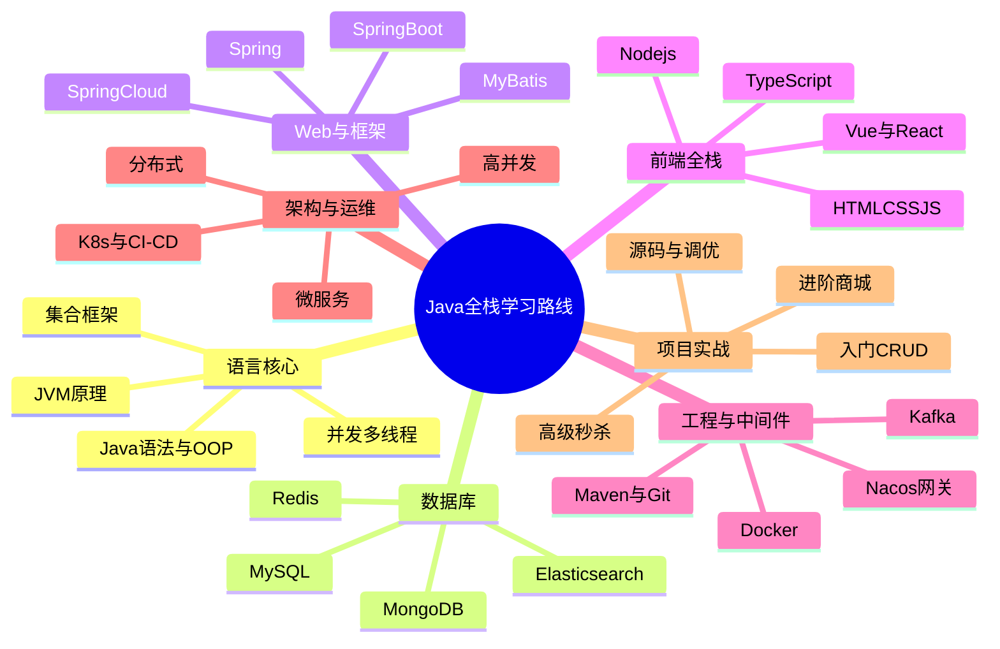

# Java 全栈学习路线总览（极详细版）

> 一份从零到架构的 Java 全栈路线图：不仅列"学什么"，更列"按什么顺序、学到什么程度、和哪些实战结合"。
> 配套：本系列已写的 4 篇 Java 手册——《Java 集合框架知识库》《Java 并发与多线程知识库》《Java IO 与 NIO 知识库》《Spring Boot 事务知识库》，文中用「👉手册」标注联动点。

---

## 一、路线总览：9 个阶段

```
阶段0  编程通识        环境搭建 / 一门语言入门思维 / 计算机基础
  ↓
阶段1  Java 语言核心   语法 / OOP / 集合 / 泛型 / 异常 / 反射 / 并发 / IO / JVM
  ↓
阶段2  数据库            MySQL / Redis / ES / MongoDB / 连接池
  ↓
阶段3  Java Web & 框架  HTTP / Servlet / Spring / Spring Boot / MyBatis / 安全
  ↓
阶段4  前端全栈          HTML/CSS/JS / TS / Vue·React / Node
  ↓
阶段5  工程化 & 中间件   Maven / Git / Docker / MQ / RPC / 注册中心 / 网关
  ↓
阶段6  架构 & 分布式      微服务 / 高并发 / 高可用 / 设计模式 / DDD
  ↓
阶段7  运维 DevOps       Linux / K8s / CI-CD / 监控 / 日志
  ↓
阶段8  项目实战          入门→进阶→高级，三个梯度的真实项目
  ↓
阶段9  进阶 & 软技能      源码阅读 / 性能调优 / 算法 / 英语 / 写作 / 通信系统(上位机背景)
```

> 说明：阶段不是严格串行。阶段 3 之后就可以边做项目（阶段 8）边补架构（阶段 6），**项目是串起一切的主线**。

---

## 二、分模块详细清单

### 模块 1 · Java 语言核心（地基中的地基）

**1.1 基础语法**
- 变量/数据类型/运算符/流程控制（if/for/while/switch）
- 数组、字符串（String 不可变、StringBuilder 对比）
- 方法、重载、可变参数、递归
- 👉 目标：能不查文档写基础程序

**1.2 面向对象（OOP）**
- 四大特性：封装 / 继承 / 多态 / 抽象
- 类与对象、构造器、this/super
- 接口 vs 抽象类、默认方法
- 内部类（成员/局部/匿名/静态）、枚举 enum
- 多态的向上/向下转型、instanceof
- 👉 目标：能用对象建模真实业务

**1.3 集合框架（👉手册《Java 集合框架知识库》）**
- List：ArrayList（扩容 1.5×）、LinkedList、Vector/Stack、CopyOnWriteArrayList
- Set：HashSet（HashMap 实现）、LinkedHashSet、TreeSet（红黑树）、EnumSet、ConcurrentSkipListSet
- Map：HashMap（扰动/树化 8·退化 6/resize 高低位拆分）、LinkedHashMap（访问顺序/LRU）、TreeMap、ConcurrentHashMap（sizeCtl+CAS+锁桶）、WeakHashMap、IdentityHashMap、EnumMap
- Queue：ArrayDeque、PriorityQueue、阻塞队列（ArrayBlockingQueue 等）、DelayQueue
- 工具：Collections、Arrays、Comparator/Comparable
- 泛型与 PECS（Producer Extends / Consumer Super）、类型擦除
- 👉 目标：能手写 LRU、TopN、交集差集；面试能讲源码

**1.4 异常与泛型**
- 受检/非受检异常、try-catch-finally/try-with-resources、自定义异常
- 泛型类/方法、通配符、边界

**1.5 反射与注解**
- Class 对象、Field/Method/Constructor 反射调用
- 元注解、自定义注解、注解处理器（APT）
- 👉 目标：看懂 Spring 怎么用反射和注解

**1.6 Lambda 与 Stream**
- 函数式接口、方法引用、四大核心函数式接口
- Stream 流水线（filter/map/reduce/collect）、并行流
- Optional 防 NPE

**1.7 并发与多线程（👉手册《Java 并发与多线程知识库》）**
- 线程创建（Thread/Runnable/Callable+Future）、线程状态
- synchronized（锁升级：无锁→偏向→轻量→重量）、volatile（可见性/有序性）
- JUC：ReentrantLock、读写锁、AQS、CountDownLatch/CyclicBarrier/Semaphore
- 线程池（7 参数 / 执行流程 / 拒绝策略）、Executors 的坑
- 并发容器、CAS 与 ABA、原子类
- 死锁、ThreadLocal、CompletableFuture
- happens-before、JMM 内存模型
- 👉 目标：能手写生产者消费者、线程池调优、定位死锁

**1.8 IO 与 NIO（👉手册《Java IO 与 NIO 知识库》）**
- BIO：字节/字符流、缓冲流、转换流、序列化
- NIO：Channel / Buffer / Selector、零拷贝
- AIO：异步通道
- NIO.2：Path / Files / WatchService
- 👉 目标：能手写文件拷贝、网络通信、理解 Netty 前置知识

**1.9 JVM（进阶必学）**
- 内存结构（堆/栈/方法区/直接内存）、对象创建与内存布局
- 垃圾回收：GC 算法、分代收集、G1/ZGC、GC 日志
- 类加载机制（双亲委派）、字节码基础
- 调优工具：jps/jstat/jmap/jstack/Arthas
- 👉 目标：能看懂 OOM、会加 JVM 参数、会用 Arthas 排障

---

### 模块 2 · 数据库与存储

**2.1 MySQL**
- 索引（B+树、聚簇/二级索引、最左前缀、覆盖索引、回表）
- 事务（ACID、隔离级别、幻读、MVCC）
- 锁（行锁/表锁、间隙锁、死锁）
- SQL 优化（执行计划 EXPLAIN、慢查询）
- 分库分表（sharding、垂直/水平拆分）
- 👉 联动《Spring Boot 事务知识库》：事务失效 10 场景在此落地

**2.2 Redis**
- 五大结构（String/Hash/List/Set/ZSet）及场景
- 持久化（RDB/AOF）、过期删除、内存淘汰
- 集群（主从/哨兵/Cluster）、缓存击穿/雪崩/穿透、布隆过滤器
- 分布式锁（SET NX）、限流、延迟队列
- 👉 目标：能设计缓存架构、手写分布式锁

**2.3 Elasticsearch**：倒排索引、DSL、分词、聚合
**2.4 MongoDB**：文档模型、适用场景
**2.5 连接池**：HikariCP、Druid 原理与配置

---

### 模块 3 · Java Web 与框架

**3.1 HTTP & Servlet**
- 请求/响应、状态码、Cookie/Session、RESTful
- Servlet 生命周期、Filter/Listener

**3.2 Spring（基石）**
- IoC / DI（控制反转、依赖注入）
- AOP（切面、通知、动态代理 JDK/CGLIB）
- Bean 生命周期、作用域、循环依赖
- 👉 目标：理解"Spring 为什么这么设计"

**3.3 Spring Boot（👉手册《Spring Boot 事务知识库》）**
- 自动配置原理（@EnableAutoConfiguration / spring.factories / SPI）
- Starter 机制、配置文件、Profile
- 事务（@Transactional 全属性、传播 7 种、隔离 4 种、失效 10 场景、代理与自调用）
- 启动流程、Actuator 监控
- 👉 目标：能手搭一个 Boot 项目并讲清自动配置

**3.4 Spring MVC**：请求映射、参数绑定、拦截器、统一异常处理、拦截器链
**3.5 MyBatis / MyBatis-Plus**：映射、动态 SQL、一级/二级缓存、逆向工程、分页插件
**3.6 安全**：Spring Security、Apache Shiro、JWT、OAuth2 / OIDC
**3.7 校验与文档**：Hibernate Validator、SpringDoc / Swagger

---

### 模块 4 · 前端全栈（Java 全栈必备）

**4.1 三件套**：HTML5 语义化、CSS（Flex/Grid/响应式）、JavaScript（ES6+：Promise/async/闭包/原型）
**4.2 TypeScript**：类型系统、接口、泛型、与 JS 互操作
**4.3 框架**：Vue3（Composition API / Pinia）或 React（Hooks / Redux），二选一深耕
**4.4 工程化**：Vite / Webpack、NPM、ESLint、包管理
**4.5 网络与状态**：Axios/fetch、跨域、Token 管理、状态管理
**4.6 UI 与组件**：Element Plus / Ant Design、组件封装
**4.7 Node.js**：Express/NestJS、能写简单 BFF 层
👉 全栈目标：前端能独立写页面调接口，后端能设计接口联调，一个人端到端交付。

---

### 模块 5 · 工程化与中间件

**5.1 构建**：Maven（生命周期/依赖/多模块）、Gradle
**5.2 版本控制**：Git（分支模型 Git Flow、rebase、冲突解决）、代码平台
**5.3 容器**：Docker（镜像/容器/Compose）、镜像优化
**5.4 消息队列**：Kafka（分区/消费者组/幂等/Exactly-Once）、RabbitMQ（交换机/路由）、RocketMQ
**5.5 RPC**：Dubbo、gRPC（IDL、序列化）
**5.6 注册配置中心**：Nacos、Zookeeper、Consul
**5.7 API 网关**：Spring Cloud Gateway、Kong（路由/限流/鉴权）

---

### 模块 6 · 架构与分布式

**6.1 微服务**：Spring Cloud Alibaba（Nacos/Sentinel/Seata/Gateway）
**6.2 高并发**：缓存、异步、池化、分库分表、CDN
**6.3 高可用**：限流（令牌桶/漏桶）、熔断降级（Sentinel/Hystrix）、降级、兜底
**6.4 一致性**：CAP/BASE、分布式事务（2PC/TCC/Saga/最终一致，👉联动事务手册）、分布式锁
**6.5 设计模式**：23 种、重点单例/工厂/策略/代理/观察者/模板/责任链
**6.6 DDD**：限界上下文、聚合根、领域事件、与贫血模型对比
**6.7 性能优化**：JVM 调优、SQL 调优、缓存、异步化、压测（JMeter）

---

### 模块 7 · 运维 DevOps

- Linux：常用命令、Shell、权限、网络排查
- 容器编排：Kubernetes（Pod/Deployment/Service/Ingress）
- CI/CD：Jenkins、GitHub Actions、GitLab CI
- 监控：Prometheus + Grafana、链路追踪（SkyWalking）
- 日志：ELK（Elasticsearch+Logstash+Kibana）
- 👉 目标：能把自己写的服务部署上线并监控

---

### 模块 8 · 测试

- 单元测试：JUnit5、Mockito、断言
- 集成测试、测试容器（Testcontainers）
- 压力测试：JMeter、Gatling
- 理念：TDD、测试金字塔

---

### 模块 9 · 项目实战路线（三个梯度）

| 梯度 | 项目 | 练到什么 |
|---|---|---|
| 入门 | 学生/图书管理、个人博客 | CRUD、分层架构、前后端联调 |
| 进阶 | 商城、论坛、后台权限系统 | 登录鉴权、缓存、分页、文件上传 |
| 高级 | 秒杀、微服务电商、IM 聊天、低代码 | 高并发、分布式事务、消息队列、网关 |

👉 实战原则：**做一个能跑起来的 > 看十个教程**。每个项目写 README、画架构图、部署上线。

---

### 模块 10 · 进阶与软技能（阶段 9）

- **源码阅读**：Spring、MyBatis、JDK 集合/并发源码（👉联动 4 篇手册）
- **算法与数据结构**：数组/链表/树/图/动态规划（面试+思维）
- **设计模式 & 重构**：写出可维护代码
- **通信系统（你的上位机背景）**：串口/Modbus/OPC UA 与后端对接，是差异化竞争力
- **英语**：能读官方文档与英文报错
- **写作**：写技术文档、复盘（呼应你《思考力》的"思维外化日志"）

---

## 三、学习建议与时间参考

- **节奏**：每天 1.5–2 小时，模块 1–3 是硬骨头，至少给 3–4 个月；后面边做项目边学。
- **顺序铁律**：先 Java 核心（模块 1）→ 数据库（模块 2）→ Spring Boot（模块 3）能写简单项目了，**立刻做项目**，再回头补框架原理和架构。
- **不要囤课**：学到能写就写，写不出说明没真懂（呼应费曼/概念压缩）。
- **源码穿插**：集合/并发/Spring 源码，学到对应模块就顺手读，别攒到最后。
- **全栈重点**：前端不用精通到像素级，但要能独立交付页面 + 联调；后端要深。

---

## 四、与已写 Java 手册的衔接

| 你今天的 Java 手册 | 在本路线中的位置 | 怎么用 |
|---|---|---|
| Java 集合框架知识库 | 模块 1.3 | 学集合时直接当源码深讲 |
| Java 并发与多线程知识库 | 模块 1.7 | 学并发时当进阶补充 |
| Java IO 与 NIO 知识库 | 模块 1.8 | 学 IO 时当网络/文件底层补充 |
| Spring Boot 事务知识库 | 模块 3.3 | 学 Spring Boot 事务时当权威参考 |

> 这四篇是你路线里"核心模块"的深度弹药；路线负责"全貌和顺序"，手册负责"钻多深"。

---

## 五、思维导图（Mermaid）



---

## 六、心法

1. **路线是地图，不是牢笼**——卡在哪补哪，别为了"学完"而学完。
2. **项目是串起一切的主线**，早做、多做、做完整的。
3. **深度靠手册，广度靠路线**——四篇 Java 手册就是你的深度弹药库。
4. **全栈不是"什么都会一点"**，是"端到端能交付"；后端要深，前端要能独立。
5. **源码和实战，是你和"只会 CRUD"的人的分水岭。**

---

## 收尾一句话

Java 全栈 = **一门扎实的 Java 核心 + 一个能打的框架（Spring Boot）+ 一套数据库与缓存 + 能独立交付的前端 + 分布式架构思维 + 项目实战**。按本路线的 9 阶段走，配合你已写深的 4 篇 Java 手册，从"会写"到"能架构"只是时间问题。


