# Markdown 思维导图语法大全（深度精编版）

> 目标：一次性讲透"在 Markdown 里画思维导图"的全部可行语法。不仅告诉你"能画"，更讲清"怎么画得对、画得漂亮、画得能在 GitHub / Obsidian / Typora / VS Code 里正常显示"。
>
> 覆盖五套方案：
> 1. **Mermaid `mindmap`** —— 真正"写在 Markdown 代码块里"的思维导图语法（最推荐）
> 2. **markmap** —— 用 Markdown 嵌套列表直接生成导图（最省事）
> 3. **Mermaid `flowchart`** —— 当思维导图当"左右树"用（可控方向）
> 4. **PlantUML `mindmap`** —— 表达力最强、可左右分侧
> 5. **标题大纲导图** —— 把 `#` 标题层级当导图根（工具自动渲染）
>
> 配套：完整实战（同一个"Java 全栈学习路线"用 4 种语法各画一遍）、平台支持对照表、10 条排错、10 条最佳实践、一页纸速查表。

---

## 目录

1. [先讲清楚：Markdown 本身没有"原生思维导图语法"](#一先讲清楚markdown-本身没有原生思维导图语法)
2. [方案一 · Mermaid mindmap（写在 Markdown 里的真·思维导图语法）](#二方案一-mermaid-mindmap写在-markdown-里的真思维导图语法)
3. [方案二 · Markdown 嵌套列表 → markmap（用列表画导图）](#三方案二-markdown-嵌套列表--markmap用列表画导图)
4. [方案三 · Mermaid flowchart 当作树/思维导图](#四方案三-mermaid-flowchart-当作树思维导图)
5. [方案四 · PlantUML mindmap（强表达力）](#五方案四-plantuml-mindmap强表达力)
6. [方案五 · 标题层级即导图（大纲导图）](#六方案五-标题层级即导图大纲导图)
7. [跨方案实战 · 同一个"Java全栈路线"用 4 种语法各画一遍](#七跨方案实战-同一个java全栈路线用-4-种语法各画一遍)
8. [平台 / 渲染器支持对照表](#八平台--渲染器支持对照表)
9. [常见坑与排错清单（10 条）](#九常见坑与排错清单10-条)
10. [最佳实践清单（10 条）](#十最佳实践清单10-条)
11. [一页纸语法速查表](#十一一页纸语法速查表)

---

## 一、先讲清楚：Markdown 本身没有"原生思维导图语法"

### 1.1 为什么没有

Markdown 的官方规范（CommonMark）只定义了标题、列表、表格、代码块、引用、强调等**线性文本元素**，并不包含"图"。思维导图本质是**树状图形**，超出纯文本表达范畴。

所以"在 Markdown 里画导图"实际是借助**扩展机制**：

- 在 Markdown 里写一段**带标记的代码块**（如 ` ```mermaid `），由渲染器把代码"渲染成图"；
- 或把 Markdown **嵌套列表**交给外部工具（markmap）转成图；
- 或靠编辑器/静态站点**插件**把标题层级可视化成图。

> 记住一句话：**Markdown 画导图 = "用约定好的文本描述树结构" + "一个能把它画出来的渲染器"**。文本是源，图是结果。

### 1.2 主流方案一览（对比表）

| 方案 | 写在哪 | 语法本质 | 方向 | 上色/图标 | 渲染器要求 | 上手难度 |
|------|--------|----------|------|-----------|------------|----------|
| Mermaid `mindmap` | ` ```mermaid ` 代码块 | 缩进文本树 | 放射状(不可改) | 支持 | Mermaid ≥ 9.3 | ⭐⭐ 中 |
| markmap | 普通 `-` 列表 / `#` 标题 | 嵌套列表 | 放射/层次 | 富文本、部分样式 | markmap 插件/CLI | ⭐ 极简 |
| Mermaid `flowchart` | ` ```mermaid ` 代码块 | 节点+连线 | LR/TD/BT 任意 | 支持 | Mermaid ≥ 8 | ⭐⭐ 中 |
| PlantUML `mindmap` | ` ```plantuml ` 代码块 | `*/+/-/_ ` 缩进 | 可左右分侧 | 支持 | PlantUML 引擎 | ⭐⭐⭐ 偏难 |
| 标题大纲 | `#` 标题层级 | 标题 | 放射 | 无 | 特定工具 | ⭐ 极简 |

### 1.3 怎么选（一句话决策）

- 想**直接写在 GitHub / Obsidian / Typora / 多数 Markdown 平台**里就能显示 → 用 **Mermaid `mindmap`**。
- 想**用最少的语法、纯列表**就出导图、还想要可折叠/可缩放交互 → 用 **markmap**。
- 想**左右分侧、精细控制样式、做正式架构图** → 用 **PlantUML** 或 **Mermaid flowchart**。
- 只是想**把文档大纲可视化** → 用**标题层级**交给支持的工具。

---

## 二、方案一 · Mermaid mindmap（写在 Markdown 里的真·思维导图语法）

这是**最符合"在 Markdown 里画思维导图"直觉**的方案：一段 ` ```mermaid ` 代码块，里面写 `mindmap` + 缩进文本，渲染器就画出放射状思维导图。

### 2.1 最小可运行示例

````markdown
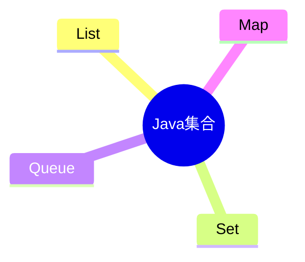
````

渲染效果（文字描述）：中心节点 `Java集合`，向四周伸出 `List / Set / Queue / Map` 四个分支。

### 2.2 代码块声明

- 用**三个反引号**包裹，第一行写 `mermaid`，第二行写 `mindmap`。
- `mindmap` 是图表类型关键字，**必须顶格、单独一行**。
- 后面所有节点用**缩进**（空格或 Tab，但整篇要一致）表示层级。

````markdown

````

> 注意：Mermaid 思维导图的渲染器从 **Mermaid 9.3** 开始支持。GitHub 目前用的 Mermaid 版本已支持；但**老旧的 Typora / 本地预览插件**若版本低于 9.3 会画不出，需升级或换 flowchart 方案。

### 2.3 根节点与层级（缩进）

- **第一个节点就是根节点**（整张图的中心）。
- 每多一层缩进 = 多一层子节点。推荐**每层 2 个空格**（或 1 个 Tab，二者选一、全文统一）。

````markdown
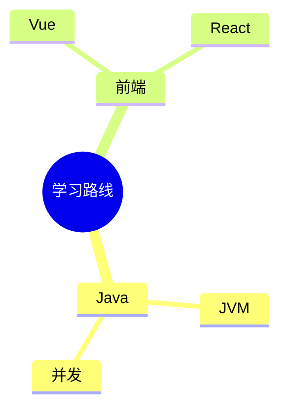
````

层级关系：

```
        JVM ─┐
             ├─ Java ─┐
       并发 ─┘         ├─ 学习路线（根）
                      │
             Vue ─┐   │
                  ├─ 前端 ─┘
            React ─┘
```

### 2.4 节点形状（默认 / 圆角 / 圆 / 菱形 / 云 / 矩形）

思维导图里不同节点可以用不同形状强调。语法是 `id[文字]`、`id(文字)`、`id((文字))`、`id{文字}`、`id))文字((`。

| 写法 | 形状 | 用途 |
|------|------|------|
| `文字`（纯文本） | 默认圆角节点 | 普通节点 |
| `id[文字]` | **矩形圆角**（box） | 强调分类 |
| `id(文字)` | ** stadium（药丸形）** | 流程/步骤 |
| `id((文字))` | **圆形** | 根节点、核心 |
| `id{文字}` | **菱形** | 判断/决策 |
| `id))文字((` | **云形** | 概念/抽象 |

````markdown
```mermaid
mindmap
  root((核心))
    A[分类A]
    B(步骤B)
    C{判断C}
    D))云D((
    E
```
````

实战：用圆作根、矩形作大类、菱形作决策点。

````markdown
```mermaid
mindmap
  root((技术选型))
    语言
      Java[后端主力]
      Python[脚本/AI]
    决策{是否高并发}
      是[上微服务]
      否[单体即可]
```
````

### 2.5 为节点上色（classDef + class）

Mermaid 默认会按层级自动分配配色。想自定义，用 `classDef` 定义样式类，再用 `class <节点id> <类名>` 应用。

- 节点若要上色，**必须给节点一个 id**（如 `a[后端]`），不能只用纯文本。
- `classDef` 写 `类名 fill:#颜色,stroke:#边色,stroke-width:2px`。
- 应用：`class a 类名`。

````markdown
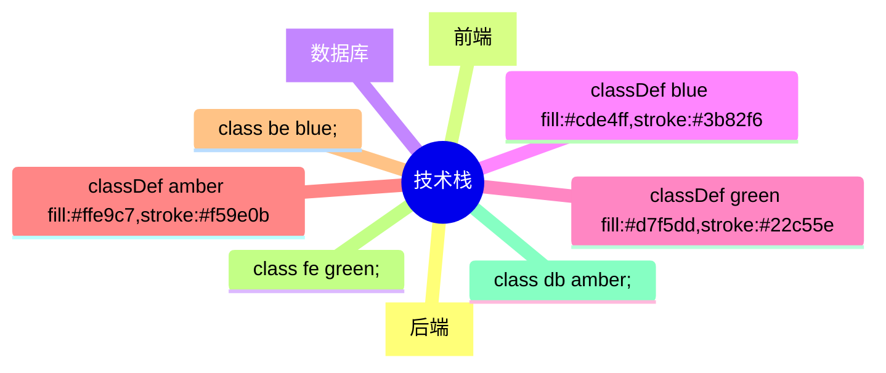
````

> 小技巧：`classDef` 和 `class` 语句本身也按缩进位置无关，放在树中任何位置都行，但通常集中写在节点下方，方便维护。

### 2.6 图标（::icon）

Mermaid 支持给节点加 FontAwesome 图标，语法 `::icon(fa fa-图标名)`，**写在该节点那一行末尾或下一行**。

````markdown
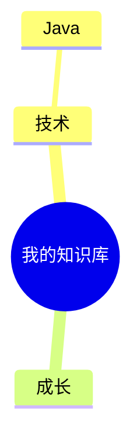
````

> ⚠️ 不是所有渲染器都内置 FontAwesome 图标库。**GitHub 对部分图标支持有限、可能不显示**；Obsidian / 自建站点（引入 fa 资源）显示更全。生产文档建议"图标锦上添花、不要依赖它表达关键信息"。

### 2.7 节点里的文本：换行、特殊字符、中文

- **中文完全支持**，放心写。
- 节点文本含**空格正常写**即可：`List[ArrayList 底层]`
- 含**括号/标点**：放在 `[...]`、`(...)`、`{...}`、`((...))` 内都安全，例如 `a[Java集合(框架)]`。
- **换行**：Mermaid mindmap 节点内换行用 `<br/>`：
  `a[第一行<br/>第二行]`
- **引号**：文本里尽量不用英文双引号；必须时用单引号或转义。
- **`<`、`>`、`&`**：属于 HTML 特殊字符，节点文本里建议避免；若需要，用 `&lt;` `&gt;` `&amp;`。

````markdown
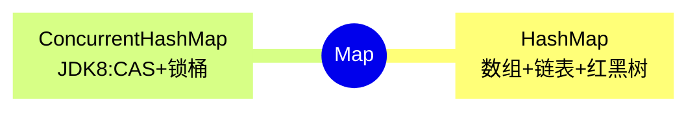
````

### 2.8 方向说明（放射状，不可改）

Mermaid `mindmap` **固定为放射状（从根向四周发散）**，不支持改成 `LR`（左右）或 `TD`（上下）。如果你需要左右布局的"树状导图"，请跳到**方案三（flowchart）**或**方案四（PlantUML）**。

### 2.9 完整实战：Java 全栈学习路线思维导图

````markdown
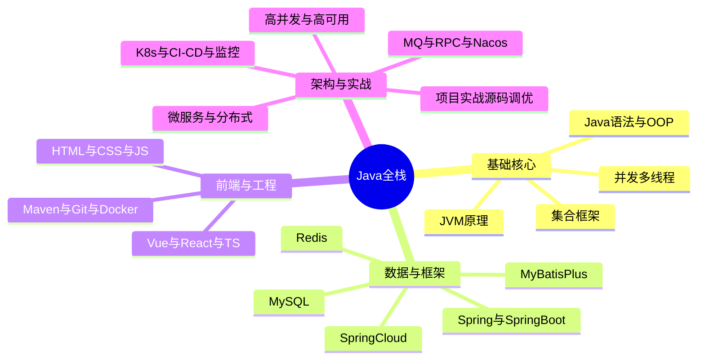
````

这就是之前"Java全栈学习路线"那张导图的标准 Mermaid 写法：4 个大类、每类若干叶子，完全由缩进决定层级。

### 2.10 常见坑（Mermaid mindmap）

1. **渲染器版本 < 9.3 画不出** —— 升级 Mermaid / 用 flowchart 替代。
2. **缩进混用 Tab 和空格** —— 全文统一用 2 空格或 1 Tab。
3. **根节点不是第一个** —— 第一个节点永远是根。
4. **上色忘了给 id** —— 纯文本节点无法 `class`，必须 `id[...]`。
5. **想左右布局** —— mindmap 不支持，换 flowchart/PlantUML。
6. **图标不显示** —— 渲染器未加载 FontAwesome，非致命。
7. **文本含 `<br>` 没用闭合标签** —— 必须写 `<br/>`。
8. **中文引号""** —— 用中文引号没问题，但英文 `"` 易与属性冲突，避免。

---

## 三、方案二 · Markdown 嵌套列表 → markmap（用列表画导图）

**markmap** 是一个工具：把你写的 **Markdown 嵌套列表（或标题层级）** 直接渲染成交互式思维导图（可缩放、可折叠）。语法简单到"你早就在用了"。

### 3.1 原理

markmap 解析 Markdown 的**缩进层级** → 生成树的父子关系 → 渲染成放射导图。你写的就是普通 Markdown，不需要任何特殊关键字。

### 3.2 最小示例

**列表式（最常用）：**

```markdown
- Java全栈
  - 基础核心
    - Java语法
    - 集合框架
  - 数据与框架
    - MySQL
    - Redis
```

**标题式（等价）：**

```markdown
# Java全栈
## 基础核心
### Java语法
### 集合框架
## 数据与框架
### MySQL
### Redis
```

两者 markmap 都会渲染成同一张以"Java全栈"为根的导图。

### 3.3 节点中写富文本（粗体 / 代码 / 链接 / 公式）

markmap 支持节点文本里嵌 Markdown 行内语法：

```markdown
- Java集合
  - **List**：`ArrayList` / `LinkedList`
  - **Map**：[HashMap 详解](https://docs.oracle.com/en/java/javase/)
  - Set：去重
```

- `**粗体**`、`*斜体*`、` `代码` `、`[链接](url)` 都生效。
- 部分 markmap 版本支持 KaTeX 公式 `$\frac{a}{b}$`。
- `<!-- 注释 -->` 不会显示，可写备注。

### 3.4 渲染方式（三种）

1. **VS Code 插件**：装 `markmap-vscode`（或 `Markmap Preview`），右侧实时出导图。
2. **在线**：把 Markdown 粘到 <https://markmap.js.org> 立即渲染，可导出 SVG/PNG/HTML。
3. **CLI**：`npx markmap-cli input.md` 生成 `input.html`（可分享）。
4. **浏览器书签**：markmap 提供"bookmarklet"，一键把当前页面 Markdown 变导图。

### 3.5 实战（带富文本的导图）

```markdown
- Java全栈学习路线
  - 基础核心
    - Java语法与OOP：`封装/继承/多态`
    - 集合框架：**List/Set/Queue/Map**
    - 并发多线程：`synchronized` / `Lock` / 线程池
    - JVM原理：内存结构 / GC
  - 数据与框架
    - MySQL：索引 / 事务 / `MVCC`
    - Redis：5 种结构 / 分布式锁
    - Spring与SpringBoot：IoC / AOP
  - 前端与工程
    - Vue与React与TS
    - Maven与Git与Docker
  - 架构与实战
    - 微服务与分布式
    - 高并发与高可用
```

### 3.6 限制与坑

- markmap **没有 Mermaid 那样的节点形状/连线上色**，风格统一、偏"脑图"。
- 不显示 Mermaid/PlantUML 那种精确几何图；它就是"层级脑图"。
- 列表**缩进必须一致**（同用 2 空格或同用 Tab），否则层级错乱。
- 标题式与列表式**不要混用同一份文档**当一张图，容易重复或层级乱。

---

## 四、方案三 · Mermaid flowchart 当作树/思维导图（可左右布局）

当你需要**左右分布、精确连线、分组背景**的导图时，Mermaid `mindmap` 不够用（它只能放射）。这时用 **`flowchart`** 把"父子节点用箭头连起来"，就是一张可控方向的树状导图。

### 4.1 为什么用它

- 可设 `LR`（左→右）、`TD`（上→下）、`BT`、`RL`。
- 节点形状、连线箭头、颜色全可控。
- 支持 `subgraph` 给分支加背景框，导图瞬间变"架构图"。

### 4.2 方向 + 父子连接（最小示例）

````markdown
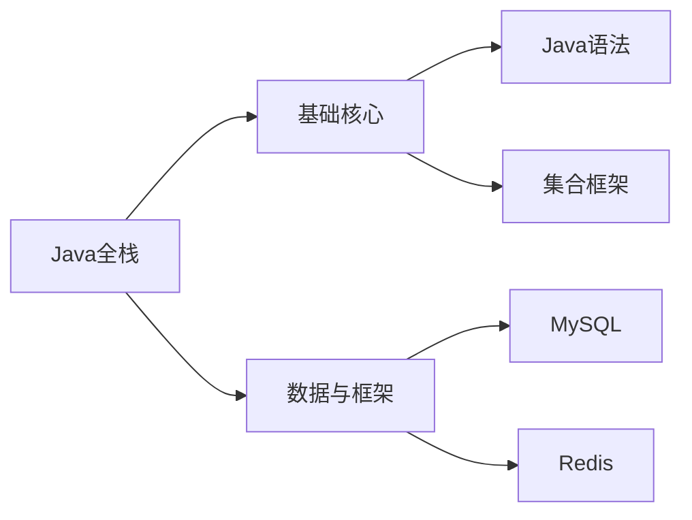
````

### 4.3 subgraph 分组（给分支加背景）

````markdown
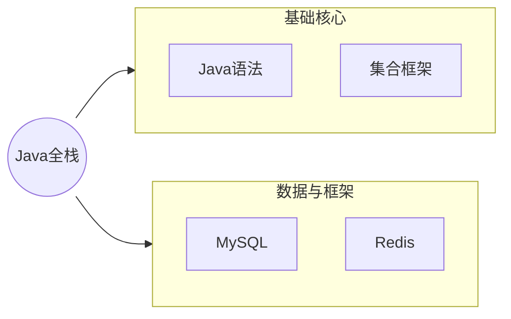
````

### 4.4 样式与连线

- 节点形状：`A[矩形]` `B(圆角)` `C{菱形}` `D((圆))`
- 连线：`--> ` 箭头、`---` 无箭头、`-.->` 虚线、`==>` 粗线
- 颜色：`style A fill:#cde4ff`
- 连线标签：`A -->|包含| B`

````markdown
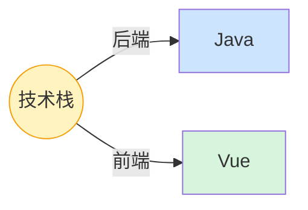
````

### 4.5 实战：左右分支导图（比 mindmap 更可控）

````markdown
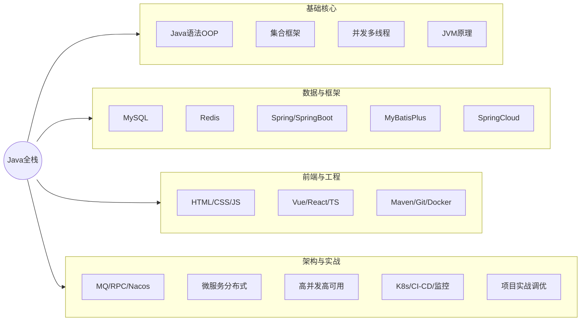
````

### 4.6 与 mindmap 的取舍

| 维度 | mindmap | flowchart 当导图 |
|------|---------|------------------|
| 方向 | 放射（固定） | LR/TD 任意 |
| 分组背景 | 无 | `subgraph` 有 |
| 连线箭头/虚线 | 无 | 有 |
| 写法难度 | 低（纯缩进） | 中（要写连线） |
| 适合 | 概念脑图 | 架构图/分类树 |

---

## 五、方案四 · PlantUML mindmap（强表达力）

PlantUML 是专门画 UML / 架构图的引擎，它的 `mindmap` 语法**表达力最强**：可左右分侧、可精细配色、可加备注。

### 5.1 代码块声明

````markdown
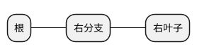
````

### 5.2 缩进与左右方向（`*` `+` `-` `_`）

- `*` / `**` / `***` → **右侧**（符号数量 = 层级深度）
- `+` / `++` / `+++` → **左侧**
- `-` / `_` 是 `*` / `+` 的变体，效果类似

````markdown
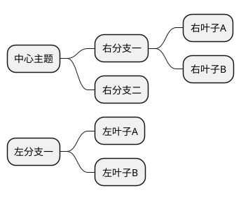
````

渲染：中心主题向**右**伸出两分支、向**左**伸出一分支，真正"左右分侧思维导图"。

### 5.3 颜色与样式

- 节点配色：`*#LightBlue 文字` 或 `*[color] 文字`
- 整图背景：`@startmindmap` 后加 `skinparam backgroundcolor ...`
- 边框：`skinparam roundCorner 10`

````markdown
```plantuml
@startmindmap
*#FFDDDD 技术栈
**#DDEEFF 后端
*** Java
*** 并发
**#DDFFDD 前端
*** Vue
*** React
@endmindmap
```
````

### 5.4 完整实战

````markdown
```plantuml
@startmindmap
*#FFF3BF Java全栈
**#CDE4FF 基础核心
*** Java语法OOP
*** 集合框架
*** 并发多线程
*** JVM原理
**#D7F5DD 数据与框架
*** MySQL
*** Redis
*** Spring/SpringBoot
*** MyBatisPlus
*** SpringCloud
**#E7E0FF 前端与工程
*** HTML/CSS/JS
*** Vue/React/TS
*** Maven/Git/Docker
**#FFE0E0 架构与实战
*** MQ/RPC/Nacos
*** 微服务分布式
*** 高并发高可用
*** K8s/CI-CD/监控
@endmindmap
```
````

### 5.5 坑

- 需要 **PlantUML 引擎**（GitHub 默认不渲染 `plantuml` 代码块，需装插件或用支持 PlantUML 的站点，如 `planttext.com`）。
- `*` 与 `+` 决定左右，**不要混用导致层级错乱**：右侧全用 `*`，左侧全用 `+`。
- 颜色值用 PlantUML 颜色名（`LightBlue`）或 `#RRGGBB`，`#` 后别加空格。

---

## 六、方案五 · 标题层级即导图（大纲导图）

很多工具（Yu Writer、部分静态站点、Obsidian 某些插件、Markdown Preview Enhanced 的 `mindmap` 指令）会把文档的 **`#` 标题层级自动渲染成思维导图**。

### 6.1 原理

`#` 一级 = 根，`##` 二级 = 分支，`###` 三级 = 叶子……层级天然对应树的深度。

### 6.2 示例

```markdown
# Java全栈
## 基础核心
### Java语法
### 集合框架
## 数据与框架
### MySQL
### Redis
```

配合支持的工具（例如在 Markdown Preview Enhanced 里用 front-matter `mindmap: true`）即可看到导图。

> 局限：样式不可控、依赖特定工具，适合"快速把一篇文档的大纲当导图看"，不适合做正式交付图。

---

## 七、跨方案实战 · 同一个"Java全栈路线"用 4 种语法各画一遍

下面把同一份"Java全栈学习路线"用四种语法各画一次，方便你直接对比、按需选用。**四种渲染结果结构一致：根=Java全栈，4 大类，每类若干叶子。**

### 7.1 Mermaid mindmap 版（推荐，GitHub 直接显示）

````markdown
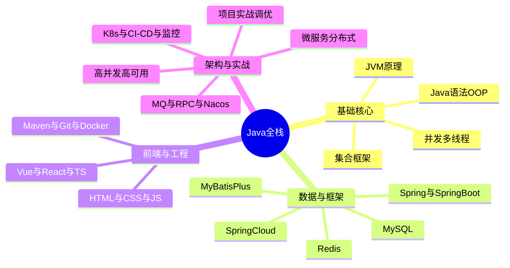
````

### 7.2 markmap 列表版（最省事）

```markdown
- Java全栈
  - 基础核心
    - Java语法OOP
    - 集合框架
    - 并发多线程
    - JVM原理
  - 数据与框架
    - MySQL
    - Redis
    - Spring与SpringBoot
    - MyBatisPlus
    - SpringCloud
  - 前端与工程
    - HTML与CSS与JS
    - Vue与React与TS
    - Maven与Git与Docker
  - 架构与实战
    - MQ与RPC与Nacos
    - 微服务分布式
    - 高并发高可用
    - K8s与CI-CD与监控
    - 项目实战调优
```

### 7.3 Mermaid flowchart 版（左右可控、带分组）

````markdown
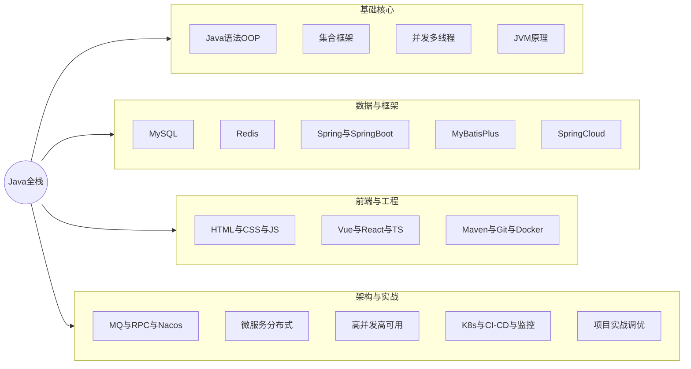
````

### 7.4 PlantUML 版（左右分侧、强配色）

````markdown
```plantuml
@startmindmap
*#FFF3BF Java全栈
**#CDE4FF 基础核心
*** Java语法OOP
*** 集合框架
*** 并发多线程
*** JVM原理
**#D7F5DD 数据与框架
*** MySQL
*** Redis
*** Spring与SpringBoot
*** MyBatisPlus
*** SpringCloud
**#E7E0FF 前端与工程
*** HTML与CSS与JS
*** Vue与React与TS
*** Maven与Git与Docker
**#FFE0E0 架构与实战
*** MQ与RPC与Nacos
*** 微服务分布式
*** 高并发高可用
*** K8s与CI-CD与监控
@endmindmap
```
````

> **选型建议**：日常写进知识库/README、要 GitHub 直接显示 → 7.1（Mermaid mindmap）；想纯列表极简、要交互缩放折叠 → 7.2（markmap）；要左右布局+分组背景做架构图 → 7.3（flowchart）；要左右分侧+精细配色且环境支持 PlantUML → 7.4。

---

## 八、平台 / 渲染器支持对照表

| 平台 | Mermaid mindmap | markmap | Mermaid flowchart | PlantUML | 标题大纲 |
|------|:---:|:---:|:---:|:---:|:---:|
| GitHub（在线） | ✅（较新版本） | ❌ 需外链 | ✅ | ❌ 需插件 | ❌ |
| Obsidian | ✅（原生） | ✅（装插件） | ✅ | ✅（装插件） | ✅（部分插件） |
| Typora | ⚠️ 看版本 | ❌ | ✅ | ❌ | ❌ |
| VS Code（预览） | ✅（装 Mermaid 插件） | ✅（markmap 插件） | ✅ | ✅（PlantUML 插件） | ❌ |
| 语雀 / 飞书文档 | ✅（部分） | ❌ | ✅ | ❌ | ❌ |
| 自建站点（Docusaurus/VitePress） | ✅（引 mermaid） | ✅（引 markmap） | ✅ | ✅（引 plantuml） | ⚠️ |

> 结论：**Mermaid 系列（mindmap / flowchart）是跨平台兼容性最好的**，优先选它。markmap 适合本地/交互场景。PlantUML 适合工程团队已用 PlantUML 的环境。

---

## 九、常见坑与排错清单（10 条）

1. **Mermaid mindmap 画不出来** → 渲染器 Mermaid 版本 < 9.3，升级或改用 flowchart。
2. **层级错乱** → 缩进混用 Tab/空格，统一为 2 空格或 1 Tab。
3. **根节点不是预期的那一个** → mindmap 第一个节点恒为根，调整顺序。
4. **想左右布局却只能放射** → mindmap 不支持，换 flowchart（LR）或 PlantUML（`*`/`+`）。
5. **节点上色无效** → 用了纯文本节点，需写成 `id[文字]` 再 `class id 类名`。
6. **图标不显示** → 渲染器没加载 FontAwesome，去掉图标或换环境。
7. **`<br>` 没换行** → 必须闭合为 `<br/>`。
8. **markmap 列表层级乱** → 同份文档混用标题式与列表式，二选一。
9. **GitHub 不渲染 plantuml** → GitHub 默认不支持，改用 Mermaid 或外链 planttext。
10. **中文引号/特殊字符报错** → 避免英文 `"`、`<`、`>` 直接用，用中文引号或 HTML 实体 `&lt;` 等。

---

## 十、最佳实践清单（10 条）

1. ✅ **默认选 Mermaid mindmap**：兼容性最好，GitHub/Obsidian/Typora 大多能显示。
2. ✅ **纯列表脑图用 markmap**：写起来最省事，还能交互缩放折叠。
3. ✅ **需要左右布局/分组背景**：用 Mermaid flowchart + `subgraph`。
4. ✅ **左右分侧+强配色**：用 PlantUML（环境支持时）。
5. ✅ **缩进全文统一**：推荐 2 空格，绝不混用 Tab。
6. ✅ **根节点放最前**：mindmap 第一个节点即根。
7. ✅ **大类用矩形 `id[...]`、根用圆 `((...))`、决策用菱形 `{...}`**：语义清晰。
8. ✅ **上色先给 id + classDef + class**：别指望纯文本节点能上色。
9. ✅ **关键文字避免英文引号/`<`/`>`**：用中文标点或 HTML 实体。
10. ✅ **一句话决策**：GitHub 直接显示→Mermaid；交互脑图→markmap；架构图→flowchart；左右分侧→PlantUML。

---

## 十一、一页纸语法速查表

**Mermaid mindmap**
```mermaid
mindmap
  root((根))
    分支
      id[矩形] id(圆角) id{菱形} id))云((
      classDef c fill:#cde4ff; class id c;
```

**markmap（列表）**
```markdown
- 根
  - 分支
    - 叶子（支持 **粗体** `代码` [链接](url)）
```

**Mermaid flowchart（左右树）**
```mermaid
flowchart LR
  root((根))
  subgraph G[分组] A B end
  root --> G
```

**PlantUML mindmap**
```plantuml
@startmindmap
*#FFF3BF 右根
** 右分支
+ 左分支
@endmindmap
```

> 记住核心心法：**Markdown 画导图 = 用约定文本描述树 + 一个能画它的渲染器**。先把树结构想清楚（根/大类/叶子三层就够），再选最合适的一套语法落地。配合本文"Java全栈路线"的 4 种写法对照着抄，你就能在任何 Markdown 场景里画出专业思维导图。
