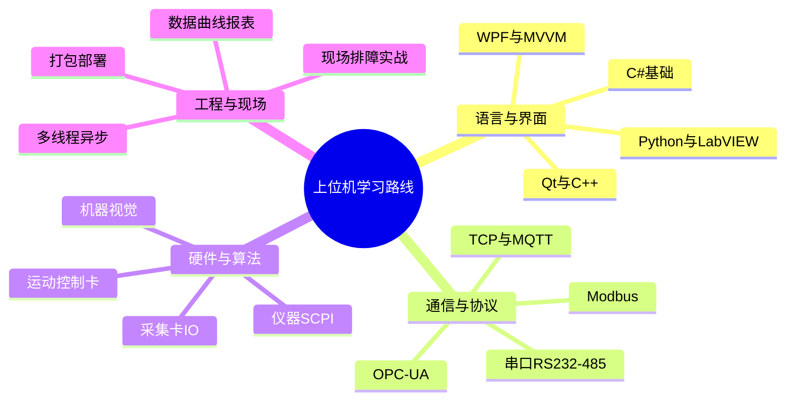

# 上位机学习路线总览（极详细版）

> 上位机 = 工业现场里"跑在 PC/工控机上的软件"：向下通过串口/网口和 PLC、仪表、运动控制卡、工业相机通信，向上做数据展示、曲线、报表、报警和人工操作界面。
> 这份路线按"阶段 + 模块"拆解，标清"学什么、学到什么程度、和什么实战结合"。
> 配套：本系列《上位机工程师能力跃迁手册》（讲能力/赚钱/复杂问题）、《沟通力》《主体意识》《把控感》。文中用「👉能力跃迁」标注联动点。

---

## 一、路线总览：10 个阶段

```
阶段0  编程通识        C# 基础 / 一门语言思维 / 计算机与电子基础
  ↓
阶段1  语言与界面       C# 精通 / WinForms / WPF(MVVM) / 备选 Qt·Python·LabVIEW
  ↓
阶段2  通信与协议       串口 / Modbus / OPC UA / TCP·UDP / CAN / MQTT / 自定义协议
  ↓
阶段3  硬件接口         采集卡 / IO / 运动控制卡 / 工业相机 / 仪器(SCPI·VISA)
  ↓
阶段4  数据与图表       SQLite·MySQL / 时序库 / 实时曲线 / 报表导出
  ↓
阶段5  多线程与异步     通信+UI 并发 / 生产者消费者 / 避免跨线程
  ↓
阶段6  视觉与运动       机器视觉 Halcon·OpenCV / 运动控制 / 视觉定位
  ↓
阶段7  组态与工业标准    OPC UA 服务 / 工业总线 / 组态软件对接
  ↓
阶段8  工程化与部署      Git / 打包 / 自动更新 / 现场加固
  ↓
阶段9  现场调试排障      出差 / 仪器 / 抓包 / 分而治之(👉能力跃迁)
  ↓
阶段10 项目实战与软技能  入门→进阶→高级，三个梯度 + 沟通/文档/英语
```

> 阶段不是串行：阶段 2 之后就能边做小项目边补后面的模块。**现场和项目是串起一切的主线。**

---

## 二、分模块详细清单

### 模块 1 · 编程语言与基础（地基）

**1.1 主语言 C#（国内上位机绝对主流）**
- 语法、OOP、委托/事件、Lamda、async/await、泛型、特性
- .NET Framework（老工控机兼容）与 .NET 6/8（新项目）区别
- 内存与时间精度（定时器：Forms.Timer / 高精度 Stopwatch / 多媒体定时器）
- 👉 目标：能不查文档写业务逻辑、懂值类型/引用类型、懂 GC 对实时性的影响

**1.2 备选语言**
- **C++ / Qt**：跨平台、性能敏感、运动控制卡 SDK 多用 C/C++
- **Python**：脚本工具、仪器控制、算法验证、数据处理
- **LabVIEW**：NI 测试测量生态，GPIB/DAQ 仪器首选（测试行业常见）

**1.3 基础素养**
- 进制与字节序（大端/小端）、位运算（协议解析必备）
- 电子基础：电平、RS232/485 区别、常见接口

---

### 模块 2 · UI 框架（界面是上位机的脸）

**2.1 WinForms**：上手快、老项目多、控件拖拽；缺点架构弱。先拿它跑通第一个程序。
**2.2 WPF（重点）**：XAML、布局、样式/模板、**MVVM 模式**（命令/绑定/通知）、Dispatcher
- 👉 目标：能用 MVVM 把界面和逻辑解耦，做出现代化界面
**2.3 第三方控件库**：DevExpress、Telerik、HandyControl、MaterialDesign（界面好看又省事）
**2.4 Qt（C++）**：信号槽、QSS、跨平台；当你做非 Windows 工控机时必备

---

### 模块 3 · 通信与协议（上位机的命门）

**3.1 串口通信（RS232 / RS485）**
- `System.IO.Ports.SerialPort`：波特率、数据位、校验位、停止位
- 232（点对点）vs 485（差分、主从、可多机）
- 常见坑：缓冲区、丢包、流控、485 方向切换
- 调试工具：串口助手（SSCOM/友善）、逻辑分析仪

**3.2 Modbus（工业事实标准）**
- RTU（走串口）与 TCP（走网口）
- 功能码：01/02/03/04 读、05/06/15/16 写；四种寄存器（线圈/离散输入/保持/输入）
- **字节序与大小端**：16/32 位数据拼装是高频坑
- 工具：Modbus Poll（主）、Modbus Slave（从）
- 👉 目标：能手写 Modbus 解析、定位"读不到值"是地址/字节序/从站号问题

**3.3 OPC / OPC UA（现代工业互联）**
- OPC DA（老，基于 COM，仅 Windows）
- **OPC UA**（跨平台、安全、有地址空间模型）——现在主流，必学
- 用 UA 客户端连 PLC/SCADA，或自己暴露 UA 服务
- 👉 目标：能配 UA 端点、读写节点、处理证书与安全策略

**3.4 TCP / UDP 通信**
- Socket 编程、粘包/拆包、心跳、断线重连
- 👉 目标：能手写稳定长连接，处理乱序与半包

**3.5 CAN / CANopen、MQTT**
- CAN：汽车/运动控制常用；CANopen 设备 profile
- MQTT：物联网上云、轻量发布订阅

**3.6 自定义协议（高频实战）**
- 帧结构：帧头 + 长度 + 命令 + 数据 + 校验（CRC16/和校验）+ 帧尾
- 收发状态机、超时重发、断点续传
- 👉 目标：能设计一套可扩展、可自校验的私有协议

---

### 模块 4 · 硬件接口与设备

**4.1 采集卡 / IO 卡**：模拟量/数字量采集，厂商 SDK（DLL/`DllImport` 调用）
**4.2 运动控制卡**：雷赛/固高/众为兴；点位运动、回零、插补、IO 联动
**4.3 工业相机**：海康/大华/Basler；相机枚举、触发、取流
**4.4 仪器控制**：VISA / SCPI 指令控电源、示波器、万用表（测试测量场景）

---

### 模块 5 · 数据与图表

**5.1 本地存储**：SQLite（轻量、零配置）、JSON/CSV/二进制日志
**5.2 服务端**：MySQL（配合后端）、时序库 InfluxDB / TDEngine（高频采样）
**5.3 实时曲线**：LiveCharts2 / OxyPlot / ScottPlot / ZedGraph / TeeChart
- 👉 目标：能做大点数、不卡顿的实时滚动曲线
**5.4 报表**：NPOI 导 Excel、报表控件、打印与历史查询

---

### 模块 6 · 多线程与异步（同时通信+刷新不卡死）

- Task / async-await、线程池、BackgroundWorker
- **生产者-消费者**：通信线程收数据 → 队列 → UI 线程刷新（BlockingCollection）
- 跨线程更新 UI：WPF `Dispatcher.Invoke`、WinForms `Control.Invoke`
- 定时器精度、避免界面假死
- 👉 目标：通信 1000Hz 也不卡 UI

---

### 模块 7 · 机器视觉与运动（进阶高薪区）

**7.1 机器视觉**
- Halcon（商业、强、贵）、OpenCV（开源、C# 用 EmguCV/OpenCvSharp）
- 流程：标定 → 预处理 → 定位 → 测量/缺陷/识别
- 应用：尺寸测量、缺陷检测、二维码/读码、视觉定位引导
**7.2 运动控制**
- 步进/伺服原理、脉冲/总线控制、回零策略、速度规划
- 多轴联动、插补
**7.3 视觉+运动结合**：手眼标定、视觉引导定位（这是高端上位机的分水岭）

---

### 模块 8 · 组态与工业标准

- **组态软件**：组态王 / 力控 / MCGS / WinCC（了解其原理，常需对接或替代）
- 工业总线：Profibus / Profinet / EtherCAT（理解概念，对接 PLC）
- OPC UA 服务暴露（模块 3.3 延伸）

---

### 模块 9 · 工程化与部署

- 版本控制：Git（分支、冲突、.gitignore 带大 SDK）
- 打包：Inno Setup / NSIS / ClickOnce / InstallShield
- 自动更新：增量更新、版本回滚
- 现场加固：工控机无外网、触控屏、开机自启、权限、数据备份
- 👉 目标：交付一个"现场双击能用、坏了能恢复"的安装包

---

### 模块 10 · 现场调试与排障（👉能力跃迁）

- **出差现场**：环境陌生、客户催、时间紧，是能力试金石
- 工具箱：串口助手、Modbus Poll、Wireshark、万用表、示波器、逻辑分析仪
- 方法论：**分而治之**——物理层/协议层/配置层/电源层逐项排除（呼应你能力跃迁手册）
- 临场：先稳住场再排障、留预案、敢拍板敢叫停
- 👉 目标：到现场不慌，按步骤把"通讯不上/数值不对/莫名其妙断线"定位到根因

---

### 模块 11 · 测试与质量

- 单元测试（通信解析、协议状态机）
- 模拟从站/桩程序（没硬件也能测）
- 压力/长时间稳定性、异常注入（断线/乱序/超时）

---

### 模块 12 · 项目实战路线（三梯度）

| 梯度 | 项目 | 练到什么 |
|---|---|---|
| 入门 | 串口调试助手 / 温湿度采集显示 | 通信+UI+曲线最小闭环 |
| 进阶 | Modbus 监控系统 / 设备数据看板 | 协议解析+数据库+报表+报警 |
| 高级 | 视觉定位运动控制设备 / OPC UA 产线集成 | 视觉+运动+总线+部署+现场 |

👉 实战原则：做一个能跑在工控机上的 > 看十个教程。每个项目写 README、画架构图、现场部署一遍。

---

### 模块 13 · 软技能与职业（👉能力跃迁）

- **需求沟通**：把客户的"我要它能用"翻译成协议/点位/界面（👉沟通力）
- **文档**：协议文档、点位表、调试记录、故障库（呼应《思考力》思维外化日志）
- **英语**：读 SDK 文档、报错、仪器 SCPI 手册
- **赚钱逻辑**：稀缺（视觉+运动）× 被看见 × 谈判（👉能力跃迁手册）
- **主体与把控**：现场不乱靠主体意识立住 + 把控感（👉相应手册）

---

## 三、学习建议与时间参考

- **语言先行**：C# + WinForms 两周跑通第一个通信程序；再攻 WPF/MVVM（1–2 月）。
- **协议是核心**：串口和 Modbus 是吃饭本领，务必手写解析，别只调库。
- **早做项目**：阶段 2 后立刻做"串口调试助手/采集显示"，再进阶。
- **视觉+运动是分水岭**：想拿高薪/出差被重用，这一步绕不开，但放后期深耕。
- **现场为王**：有机会出差就上，排障经验是简历上最硬的一条（👉能力跃迁）。

---

## 四、与已写手册的衔接

| 已写手册 | 在本路线位置 | 怎么用 |
|---|---|---|
| 上位机工程师能力跃迁手册 | 模块 10/13、阶段 9 | 讲"能力/赚钱/复杂问题"，本路线负责"学什么顺序" |
| 沟通力全面修炼 | 模块 13 | 需求沟通、客户对接直接用 |
| 主体意识与情绪安放 | 模块 10/13 | 现场不乱、不被情绪劫持 |
| 男性生活把控感 | 模块 10 | 现场与客户现场的"可控域"心态 |
| 思考力自我锻造 | 模块 13 | 文档/故障库 = 思维外化 |

---

## 五、思维导图（Mermaid）



---

## 六、心法

1. **协议是上位机的命门**——串口/Modbus 不扎实，现场寸步难行。
2. **现场为王**：排障经验比任何证书都硬，出差别躲。
3. **视觉+运动是分水岭**：想从"写界面"到"系统交付"，这一步必走。
4. **路线是地图不是牢笼**——卡哪补哪，项目驱动。
5. **你已有的《能力跃迁手册》管"怎么强"，本路线管"学什么"**，两本配合吃透。

---

## 收尾一句话

上位机 = **一门扎实的 C#/WPF + 吃透串口与 Modbus/OPC UA + 稳的多线程通信 + 数据曲线报表 + （进阶）视觉与运动 + 现场排障**。按本路线 10 阶段走，配合你已写深的《上位机能力跃迁手册》，从"会做个界面"到"能独立交付一套设备软件"只是时间问题。
