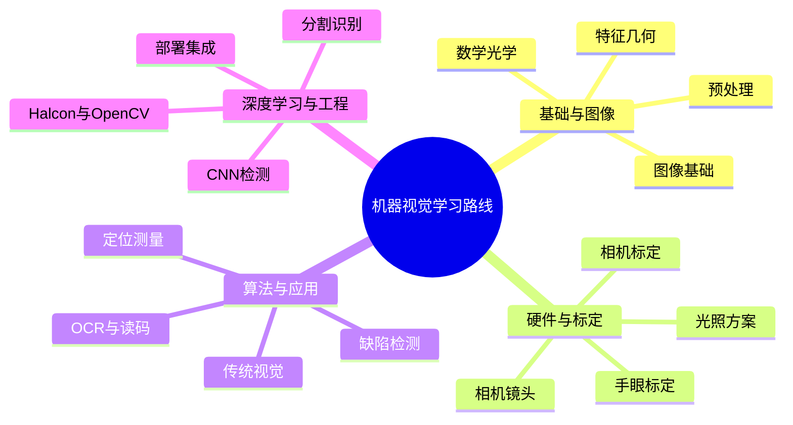

# 机器视觉学习路线总览（极详细版）

> 机器视觉 = 用相机+算法代替人眼做"识别、定位、测量、检测"。工业里它和 motion（运动控制）组合，就是高端设备软件的核心。
> 这份路线按"阶段 + 模块"拆解，标清"学什么、学到什么程度、和什么实战结合"。
> 配套：本系列《上位机学习路线》（视觉是其中进阶模块）、《上位机工程师能力跃迁手册》。文中用「👉上位机路线」「👉能力跃迁」标注联动点。

---

## 一、路线总览：11 个阶段

```
阶段0  数学与光学基础     线性代数 / 概率 / 信号处理 / 几何光学常识
  ↓
阶段1  图像基础           像素 / 色彩空间 / 采样量化 / 图像格式
  ↓
阶段2  图像预处理         灰度 / 滤波 / 形态学 / 二值化 / 边缘 / 几何变换
  ↓
阶段3  特征与几何         轮廓 / 斑点 / 特征点 / 拟合 / 仿射变换
  ↓
阶段4  相机与光学         相机选型 / 镜头 / 打光方案（现场成败各半）
  ↓
阶段5  标定               相机标定 / 畸变校正 / 手眼标定 / 坐标系
  ↓
阶段6  传统视觉算法       定位 / 测量 / 缺陷 / OCR / 读码
  ↓
阶段7  深度学习视觉       CNN / 检测 / 分割 / 训练与部署
  ↓
阶段8  工具与框架         Halcon / OpenCV / VisionPro / 厂商 SDK
  ↓
阶段9  与运动控制集成     上位机联动 / 给 PLC 结果（👉上位机路线）
  ↓
阶段10 工程化部署         C#/C++ 集成 / 多线程 / 现场稳定性
  ↓
阶段11 项目实战与软技能   入门→进阶→高级，三梯度 + 文档/沟通
```

> 阶段 2–3 是基本功，阶段 4–5 决定现场成败，阶段 6 是吃饭本领，阶段 7 是趋势必学。深度学习不是替代传统，而是补充。

---

## 二、分模块详细清单

### 模块 1 · 数学与光学基础（地基）

- **线性代数**：矩阵、向量、仿射/透视变换（图像几何运算底层）
- **概率与统计**：高斯分布（滤波/阈值）、贝叶斯（分类）
- **信号处理**：卷积（滤波核）、频域（傅里叶，去周期噪声）
- **几何光学常识**：焦距、光圈、景深、放大率、畸变类型（枕/桶）
- 👉 目标：看懂算法公式不慌，打光和选型时知道物理量关系

### 模块 2 · 图像基础

- 数字图像：像素、位深（8/16 bit）、分辨率
- 色彩空间：RGB / HSV（阈值更稳）/ 灰度 / Lab
- 采样与量化、图像格式（BMP/PNG/JPEG/TIFF，工业多用无压缩）
- 内存布局（H×W×C）、ROI 概念
- 👉 目标：清楚一张图在内存里长什么样

### 模块 3 · 图像预处理（90% 项目成败在前处理）

- 灰度化、直方图均衡、对比度增强
- **滤波**：均值/高斯（去噪）、中值（去椒盐）、双边（保边）
- **形态学**：膨胀/腐蚀/开闭运算（去毛刺、填洞）
- **二值化**：全局/局部（自适应）、阈值选取（OTSU）
- **边缘**：Sobel/Canny、亚像素边缘
- **几何变换**：缩放/旋转/仿射/透视、插值
- 👉 目标：能把"看不清"的图像处理到"算法能稳定提取特征"

### 模块 4 · 特征与几何

- 轮廓查找、面积/周长/矩/重心/方向
- 斑点分析（Blob）：连通域、筛选条件
- 特征点：Harris/SIFT/SURF（配准、拼接）
- **几何拟合**：圆/直线/矩形/椭圆（测量基础）
- 仿射变换、极性（模板匹配的方向无关性）
- 👉 目标：从图像里拿到"可量化的几何量"

### 模块 5 · 相机与光学（现场成败各半）

**5.1 相机**
- 传感器：CCD vs CMOS、全局快门 vs 卷帘快门（运动模糊关键）
- 参数：分辨率、帧率、像元尺寸、动态范围
- 接口：GigE / USB3 / Camera Link / CoaXPress（带宽与距离）
- 选型：面阵 vs 线阵（连续材料用线阵）

**5.2 镜头**
- 焦距、视场 FOV、工作距离 WD、**放大率 = 传感器尺寸 / FOV**
- 光圈 F、景深、畸变、靶面匹配（镜头靶面 ≥ 传感器）
- 👉 目标：能按 FOV 和精度反推相机+镜头

**5.3 光照（最容易被低估）**
- 明场/暗场、同轴/环形/条形/背光源、漫射
- 波长与颜色（利用色差提对比）、频闪（拍运动）
- 👉 目标：能针对"反差小/反光/透明"物体设计打光方案

### 模块 6 · 标定

- **相机标定**：棋盘格/圆点标定，求内参（焦距/主点/畸变）、外参
- 畸变校正：桶形/枕形、切向畸变
- **手眼标定**：eye-in-hand / eye-to-hand、九点标定、AX=XB 求解
- 坐标系：图像坐标→相机坐标→机器人/世界坐标
- 👉 目标：能做到"图像里毫米级定位，且和机械坐标对得上"

### 模块 7 · 传统视觉算法（吃饭本领）

- **定位**：模板匹配（形状/NCC/基于描述子）、极性不变
- **测量**：边缘对、卡尺工具、亚像素测距、尺寸/角度
- **缺陷检测**：差分比对、背景对、纹理/边缘异常、轮廓偏差
- **识别/OCR**：字体训练、字符分割、置信度
- **读码**：一维码（Code128 等）、二维码（QR/DataMatrix）
- 👉 目标：不依赖深度学习就能交付大多数定位/测量/OCR/读码项目

### 模块 8 · 深度学习视觉（趋势必学）

- 基础：CNN 结构（卷积/池化/激活）、前向/反向传播直觉
- **任务三类**：分类 / 检测（YOLO·SSD·Faster R-CNN）/ 分割（U-Net·Mask R-CNN）
- 数据：采集、标注（LabelImg/LabelMe）、**数据增强**（旋转/亮度/噪声）、难例挖掘
- 训练：迁移学习（预训练权重）、过拟合对策、指标（mAP/IOU/精确率）
- **部署**：ONNX / TensorRT / OpenVINO / 厂商工具（海康/大华/算法平台）
- 👉 目标：复杂缺陷、不规则识别用 DL 解决，传统方法搞不定的用 DL 补

### 模块 9 · 工具与框架

- **Halcon（MVTec）**：工业首选，算子全、稳定、有深度学习模块；商业授权
- **OpenCV**：开源圣经，C++/Python；C# 用 **EmguCV / OpenCvSharp**
- **VisionPro（康耐视）**：拖拽式，硬件绑定
- **厂商 SDK**：海康/大华/Basler/华睿，取流与控制
- 👉 目标：至少精通 Halcon 或 OpenCV 其一，能读厂商 SDK 接相机

### 模块 10 · 与运动控制集成（👉上位机路线）

- 视觉结果 → 上位机（C#/C++）→ 运动控制卡/PLC
- 触发同步：相机硬触发、运动到位再拍
- 手眼标定结果落地到坐标变换
- 👉 目标：视觉不是孤立 Demo，而是设备里"看见→决策→动"的一环（呼应上位机路线模块 7）

### 模块 11 · 工程化部署

- 与上位机集成（C# 调 Halcon/OpenCV 的 DLL/封装）
- 多线程：取流 / 算法 / 显示 分离（👉上位机路线模块 6）
- 性能：ROI 裁剪、降分辨率、GPU、异步
- 现场稳定性：异常处理、参数可配置、日志、回放
- 👉 目标：交付一个"产线 7×24 不崩"的视觉模块

### 模块 12 · 项目实战路线（三梯度）

| 梯度 | 项目 | 练到什么 |
|---|---|---|
| 入门 | 二维码识别 / 零件计数 / 尺寸测量 | 相机取流+预处理+几何 |
| 进阶 | 缺陷检测 / 字符 OCR / 模板定位引导 | 传统算法闭环 |
| 高级 | 深度缺陷分割 / 视觉引导运动对位 / 多相机 | DL+手眼+集成+部署 |

👉 实战原则：先拿公司/网上的真实图集练，再上真实相机；每个项目留"参数表+效果截图+失败案例"。

### 模块 13 · 软技能与职业（👉能力跃迁）

- **需求翻译**：把"帮我看看这个坏没坏"翻译成缺陷标准/公差/良率
- **打光实验记录**：不同光源对比，形成自己的"打光库"
- **文档**：视觉方案书、标定报告、验收标准
- **赚钱逻辑**：视觉+运动稀缺组合 × 被看见 × 谈判（👉能力跃迁）
- **现场心态**：标定对不上、误判时稳得住（👉主体意识/把控感）

---

## 三、学习建议与时间参考

- **前处理是内功**：模块 2–4 不熟，后面全晃。先把一张图"玩透"。
- **打光决定上限**：同一算法，打光对了 99% 稳，打光错了全废。多动手做光照实验。
- **传统打底，DL 进阶**：先把定位/测量/OCR 用传统方法做扎实，再学 DL 处理复杂缺陷。
- **标定是分水岭**：手眼标定做不对，视觉引导运动就是空中楼阁。
- **早接上位机**：阶段 9 起就把视觉塞进上位机项目，别停在 Python Demo。

---

## 四、与已写手册的衔接

| 已写手册 | 在本路线位置 | 怎么用 |
|---|---|---|
| 上位机学习路线 | 模块 10/11、阶段 9–10 | 视觉是上位机的进阶模块，集成与部署看那篇 |
| 上位机工程师能力跃迁 | 模块 13、阶段 11 | 稀缺组合（视觉+运动）、赚钱、现场复杂问题 |
| 思考力自我锻造 | 模块 13 | 打光实验/失败案例 = 思维外化日志 |
| 主体意识与把控感 | 模块 13 | 现场标定/误判时不慌 |

---

## 五、思维导图（Mermaid）



---

## 六、心法

1. **打光决定上限，算法决定下限**——现场 80% 的问题靠光解决。
2. **前处理是内功**，别急着上深度学习。
3. **传统打底，DL 进阶**：DL 是补充不是替代。
4. **标定对不上，一切白搭**——手眼标定是高端分水岭。
5. **视觉不是 Demo，是设备里"看见→决策→动"的一环**（👉上位机路线）。

---

## 收尾一句话

机器视觉 = **扎实的图像处理内功 + 吃得透的相机/镜头/打光 + 过硬的标定（尤其手眼）+ 传统算法闭环 + （进阶）深度学习 + 与上位机/运动控制的集成部署**。按本路线 11 阶段走，配合你已写的《上位机学习路线》，从"会跑个识别"到"能交付一套视觉引导设备"只是时间问题。
